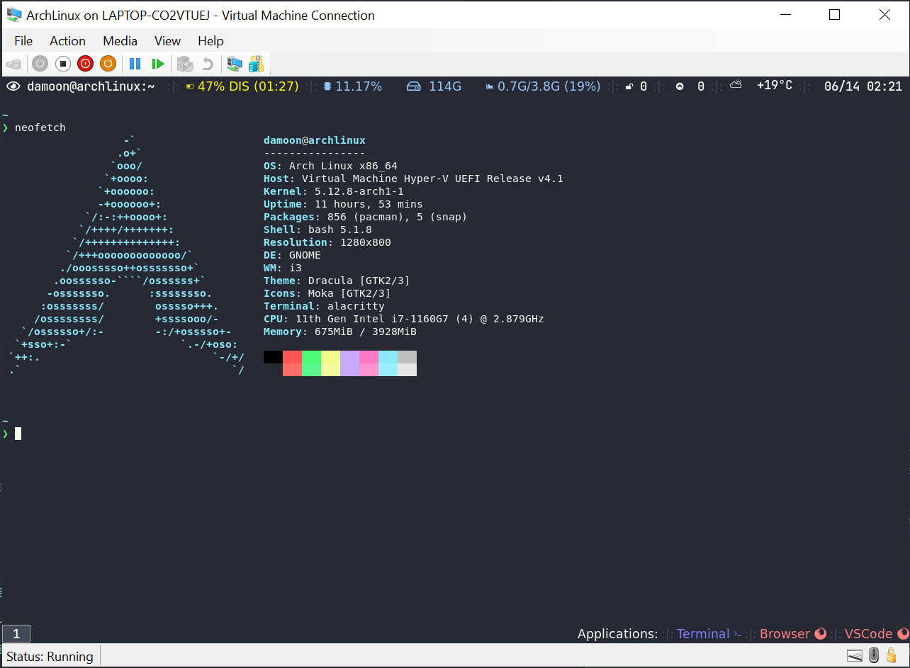

# archlinux-regolith-de



- [archlinux-regolith-de](#archlinux-regolith-de)
  - [overview](#overview)
  - [usage](#usage)
    - [assumptions](#assumptions)
    - [hyper-v Setup](#hyper-v-setup)
    - [Arch Linux Setup](#arch-linux-setup)
    - [hyperv-finalization](#hyperv-finalization)
    - [Arch Linux post-setup](#arch-linux-post-setup)
  - [references](#references)

## overview

This repository contains powershell and bash scripts to setup Arch Linux with [Regolith](https://regolith-linux.org) desktop environment.

- personally, I have found that Arch Linux inside a Hyper-V box with 4GB of ram and 4 Logical cores performs significantly better
  than Windows host that has 16 GB of ram and 8 Logical cores. The laptop I am using is Lenvo X12 , and for windows updates , I am on insider channel.
- I am using `btrfs` file system for arch installation.
- this installation only uses i3 window manager
- I am using regolith flavored i3, as I really like the defaults it provides
- in case you are not using these scripts to install Arch in hyper-v, you would need to remove hyper-v specific pieces from `02-arch-setup.sh` ; namely the sections that setup `xrdp` and `Microsoft/linux-vm-tools` ( lines `401`-`418`)

## usage

### assumptions

- you are running windows 10 pro with hyper-v enables
- you have admin privileges
- your host has 16GB of memory. this is not a hard requirement
- your host cpu has 8 logical cores.this is not a hard requirement
- `aria2` is installed in windows. you can use package managers such as scoop to install it.
- you have cloned this repository to your disk

### hyper-v Setup

- modify `01-hyperv-init.ps1` script to suit your needs by modifying variables in `VM CONFIG` section of the script:
  - set `$$VMName` to change VM name from default value
  - set `$MemoryStartupBytes` to the amount of RAM you want to allocate for the VM. I would recommend setting VM ram to a quarter of what is available on host, as Windows seems to have horrendous memory management.
  - set `$VMProcessorCount` to the amount of Logical CPU cores you want to allocate to the VM. I would recommend using half of the logical cores available on your CPU.
  - set `$VHDSizeBytes` to the amount of HDD you want to allocate to the VM
- open a new powershell window in administrator mode.
- run `01-hyperv-init.ps1` script.
- start the VM

```powershell
Start-VM -Name $VMName
```

- connect to the VM through Virtual Machine Connection (VMConnect)

```powershell
$HOSTNAME = (Get-WmiObject -Class Win32_ComputerSystem -Property Name).Name
VMConnect $HOSTNAME $VMName
```

- inside arch installer media shell, set a root password and enable ssh

```bash
echo 'root:root' | chpasswd
systemctl start sshd
```

- find out IP address of the interface, as we will ssh into it from powershell in arch install stages

```bash
ip a show dev eth0 | grep -w inet
```

- open a new, non elevated powershell window. ssh into the VM in the new window. the ssh password will be `root`. You can use the following snippet ; change `192.168.2.246` to match IP address of your VM

```powershell
ssh -o StrictHostKeyChecking=no -o UserKnownHostsFile=/dev/null root@192.168.2.246
```

- do not close the elevated powershell window as you need it in the following steps.

### Arch Linux Setup

- modify `02-arch-setup.sh` script. search for `damoon` and change it to the username of your own choosing.
- move script into the VM with scp. execute this command in the other powershell window.

```powershell
scp -o StrictHostKeyChecking=no -o UserKnownHostsFile=/dev/null 02-arch-setup.sh root@192.168.2.246:/root/
```

- execute the script in the ssh session you opened.

```bash
bash /root/02-arch-setup.sh
```

- after the script has finished execution, it would turn off the VM. you should be ready to use the VM.

### hyperv-finalization

- this phase is not mandatory.
- Enable enhanced session mode. I highly encourage using enhanced session mode.

```powershell
Set-VM -VMName $VMName -EnhancedSessionTransportType HvSocket
```

- Change boot order for VM

```powershell
$gen2 = Get-VMFirmware $VMName
$gen2file = $gen2.BootOrder[0]
Set-VMFirmware -VMName $VMName -FirstBootDevice $gen2file
Get-VMFirmware $VMName
```

- Remove DVD from VM with same SCSI as HDD

```powershell
Get-VMDvdDrive -VMName $VMName -ControllerNumber 0 | Remove-VMDvdDrive
```

- Remove DVD Scsi controler from VM

```powershell
Get-VMScsiController -VMName $VMName -ControllerNumber 1 | Remove-VMScsiController
```

### Arch Linux post-setup

- this phase is not mandatory.
- `02-arch-setup.sh` script sets up default regolith look. in I have included my dotfiles under `dotfiles` folder. In the following steps, I will show you how to create your own dotfiles repo , put my dotfiles in it and use `rcm` for managing your VMs dotfiles.
- install [rcm](https://github.com/thoughtbot/rcm)
- create a repository for your box's dot files, e.g `hyperv-dotfiles`
- clone the empty repository to `~/.dotfiles`

```bash
git clone /repo/uri.git ~/.dotfiles
```

- copy all files in this repository's `dotfiles` directory to  `~/.dotfiles`

```bash
cp -r dotfiles/* ~/.dotfiles/
```
- commit and push the changes for your  `hyperv-dotfiles` repository.
- run `rcup` in your shell to have it create the symlinks for you. accepts all changes.
- restart your VM. You should have the same environment as mine.

## references

- https://www.distrotube.com/guest-articles/managing-dotfiles-with-rcm.html
- https://thoughtbot.com/upcase/videos/manage-and-share-your-dotfiles-with-rcm